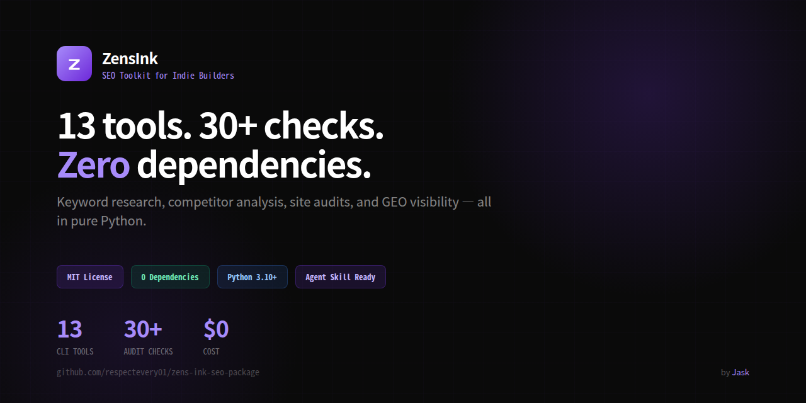

<div align="center">


# ZensInk



### SEO Toolkit for Indie Builders

CLI tools for keyword research, competitor analysis, and technical audits. Zero dependencies, pure Python.

[English](README.md) · [中文](README.zh.md)

[](https://opensource.org/licenses/MIT)
[](https://www.python.org)
[](https://github.com/ZensInk/zens-ink-seo-package)
[](SKILL.md)
[](https://github.com/ZensInk/zens-ink-seo-package)
[](https://github.com/ZensInk/zens-ink-seo-package)
[](https://github.com/ZensInk/zens-ink-seo-package/pulls)

</div>

---

Thirteen CLI tools that cover the full SEO workflow — from discovering what people search, to clustering keywords by topic, to classifying search intent, to auditing your own site. No paid APIs. No Ahrefs. No subscriptions. Just free data sources wired together with Python.

| Tool | What it does | API needed |
|------|-------------|-----------|
| `keyword_research` | Discover long-tail keywords via Google Autocomplete | None |
| `keyword_cluster` | Group keywords into semantic topic clusters | None |
| `kd` | Keyword difficulty score via SERP structure analysis | Free Serper key |
| `kgr_auto` | KGR opportunity scoring (competition vs volume) | Optional Bing key |
| `keyword_volume` | Real search volume via Bing Webmaster API | Free Bing key |
| `brave_volume` | Cross-check search demand via Brave SERP signals | Free Brave key |
| `domain_rating` | Real Ahrefs Domain Rating (0-100) via the free public API | Free Ahrefs key |
| `search_intent` | Classify keywords by search intent (info/commercial/transactional) | None |
| `content_matrix` | Prioritized content opportunity matrix | None |
| `competitor_gap` | Compare multiple competitor sitemaps, find content gaps | None |
| `site_audit` | Technical SEO + GEO audit: 30 checks covering links, meta, images, structured data, AI visibility | None |
| `onpage_audit` | On-page quality scoring (7 dimensions, 0-100 per page) | None |
| `setup_gsc` | One-time OAuth setup for Google Search Console | — |
| `search_performance` | Your site's real Google ranking data (GSC) | Free GSC OAuth |

## Why

Ahrefs costs $200/month. SEMrush costs $130/month. For indie builders who just need to find keywords worth writing about, that's overkill.

zens.ink wires together free public data sources — Google Autocomplete, Bing Webmaster Tools, Google Search Console, Brave Search, Ahrefs Domain Rating — with zero Python dependencies.

## Install

**Option A — pip (recommended)**

```bash
pip install zens-ink
```

After install, the `zens-ink` command is available globally:

```bash
zens-ink --help
```

**Option B — git clone**

```bash
git clone https://github.com/ZensInk/zens-ink-seo-package.git
cd zens-ink-seo-package
```

## Quick Start

```bash
# Discover keywords (with a-z long-tail expansion)
zens-ink keyword_research "tarot" --expand

# Check real search volume
zens-ink keyword_volume "tarot reading" --country us

# Keyword difficulty (SERP-based, with Chinese mode)
zens-ink kd "塔罗牌" --zh

# Compare 3 competitors at once
zens-ink competitor_gap \
  --url https://yoursite.com/sitemap.xml \
  --compare https://competitor-a.com/sitemap.xml https://competitor-b.com/sitemap.xml

# Audit your build for SEO issues
zens-ink site_audit --dist dist --sitemap dist/sitemap.xml

# Check your own Google search performance
zens-ink search_performance
```

<details>
<summary>Not installed? Use <code>python3 -m</code> instead</summary>

```bash
python3 -m zens_ink.keyword_research "tarot" --expand
python3 -m zens_ink.kd "tarot reading"
python3 -m zens_ink.site_audit --dist dist --sitemap dist/sitemap.xml
```

</details>

## Use as Agent Skill

ZensInk works as an AI agent skill — let your AI assistant run SEO tools for you in plain language.

```bash
# Install for ClawHub / OpenClaw / Hermes compatible agents
npx skills add ZensInk/zens-ink-seo-package --skill zens-ink
```

Then just tell your AI: "find keywords for my tarot site" and it runs the tools for you. See [SKILL.md](SKILL.md) for details.

## Use as MCP Server (DSH / Claude / Codex)

ZensInk ships a built-in MCP stdio server — every tool becomes a native model tool (`mcp__zensink__keyword_research`, `mcp__zensink__kd`, ...). Pure stdlib, zero extra dependencies.

```bash
python3 -m zens_ink.mcp    # MCP stdio server on stdin/stdout
```

Add to [DeepSeek Harness (DSH)](https://github.com/deepseek-ai/deepseek-harness) — `~/.dsh/profiles/web/cordis.patch.yml`:

```yaml
- insert:
    - id: mcp-zensink
      name: '@deepseek-ai/dsh-mcp-client'
      config:
        serverName: zensink
        transport: stdio
        command: python3
        args: ['-m', 'zens_ink.mcp']
        toolCallTimeoutMs: 300000
```

For other MCP clients (Claude Desktop, Codex, ...), point the stdio command at `python3 -m zens_ink.mcp`. API keys are read from the package root `.env` as usual.

If the [Pro package](https://zens.ink) (`zens_ink_pro`) is installed alongside, its tools (winability, content_radar, competitor_radar, geo_score, geo_visibility, gap_deep, full_audit) are picked up automatically — the same server exposes everything available on that machine. OSS-only installs stay OSS-only.

## Typical Workflow

```
keyword_research  →  find what people actually search
        ↓
keyword_volume    →  filter by real demand
        ↓
kd                →  pick keywords you can actually rank for
        ↓
competitor_gap    →  see what competitors already cover
        ↓
site_audit        →  make sure your pages are crawlable
```

## Requirements

- Python 3.10+
- Zero dependencies — pure standard library
- Optional API keys (Bing, Serper, Brave, GSC) in `.env` — see `.env.example`

## Documentation

- **Changelog**: [CHANGELOG.md](CHANGELOG.md)

- **Full docs & case studies**: [zens.ink/docs](https://zens.ink/docs)
- **Pro package** (automated full-audit pipeline, HTML reports, GEO score): [zens.ink](https://zens.ink)

## License

MIT — free for personal and commercial use.

---

<div align="center">

Made by [Jask](https://github.com/respectevery01)

</div>
