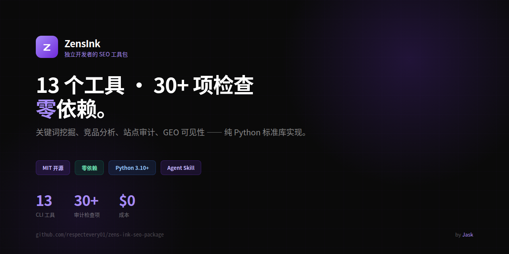

<div align="center">


# ZensInk



### 独立开发者的 SEO 工具包

关键词研究、竞品分析、技术审计。零依赖，纯 Python。

[English](README.md) · [中文](README.zh.md)

[](https://opensource.org/licenses/MIT)
[](https://www.python.org)
[](https://github.com/ZensInk/zens-ink-seo-package)
[](SKILL.md)
[](https://github.com/ZensInk/zens-ink-seo-package)
[](https://github.com/ZensInk/zens-ink-seo-package)
[](https://github.com/ZensInk/zens-ink-seo-package/pulls)

</div>

---

十三个命令行工具，覆盖完整 SEO 流程 —— 从发现用户搜什么，到聚类分组、意图分类，到审计自己的站点。不需要付费 API，不需要 Ahrefs，不需要订阅。只用免费数据源 + Python 标准库。

| 工具 | 功能 | 需要密钥 |
|------|------|---------|
| `keyword_research` | 通过 Google 自动补全发现长尾关键词 | 无 |
| `keyword_cluster` | 将关键词按语义相似度聚类分组 | 无 |
| `kd` | 基于 SERP 结构分析关键词难度 | 免费 Serper key |
| `kgr_auto` | KGR 机会评分（竞争度 vs 搜索量） | 可选 Bing key |
| `keyword_volume` | 通过 Bing 站长 API 获取真实搜索量 | 免费 Bing key |
| `brave_volume` | 通过 Brave 搜索信号交叉验证搜索需求 | 免费 Brave key |
| `domain_rating` | Ahrefs 真实 Domain Rating（0-100），走免费公共 API | 免费 Ahrefs key |
| `search_intent` | 搜索意图分类（信息/商业/交易/导航） | 无 |
| `content_matrix` | 优先级内容机会矩阵 | 无 |
| `competitor_gap` | 多竞品 sitemap 对比，找出内容缺口 | 无 |
| `site_audit` | 技术 SEO + GEO 审计：30 项检查，覆盖链接、元数据、图片、结构化数据、AI 可见性 | 无 |
| `serp_intent` | 基于 SERP 的意图分析——逆向工程 Google 真实排名行为 | 免费 Serper key |
| `onpage_audit` | 页面质量评分（7 维度，每页 0-100 分） | 无 |
| `geo_fanout` | Query Fan-out 内容规划（GEO/AI 搜索） | 无 |
| `reddit_blueocean` | Reddit 蓝海关键词挖掘（自动补全驱动） | 无 |
| `content_qc` | AI 可引用内容发布前质检（14 项加权检查） | 无 |
| `llms_gen` | 从构建目录或 sitemap 生成 `llms.txt` + `llms-full.txt` | 无 |
| `ai_crawler_audit` | robots.txt AI 爬虫策略 + llms.txt 层审计，AI 可读性评分 | 无 |
| `rank_tracker` | SQLite 关键词排名历史追踪 | 免费 Serper key |
| `setup_gsc` | Google Search Console OAuth 一次性配置 | — |
| `search_performance` | 你在 Google 上的真实排名数据（GSC） | 免费 GSC OAuth |

## 为什么做这个

Ahrefs 每月 $200，SEMrush 每月 $130。对独立开发者来说，只是想做关键词研究，太贵了。

zens.ink 把免费公开数据源 —— Google 自动补全、Bing 站长工具、Google Search Console、Brave 搜索、Ahrefs Domain Rating —— 串在一起，零 Python 依赖。

## 安装

**方式一 — pip（推荐）**

```bash
pip install zens-ink
```

安装后 `zens-ink` 命令全局可用：

```bash
zens-ink --help
```

**方式二 — git clone**

```bash
git clone https://github.com/ZensInk/zens-ink-seo-package.git
cd zens-ink-seo-package
```

## 快速开始

```bash
# 发现关键词（a-z 长尾展开）
zens-ink keyword_research "塔罗牌" --lang zh --expand

# 查搜索量
zens-ink keyword_volume "塔罗牌" --country cn --lang zh-CN

# 关键词难度（支持中文模式）
zens-ink kd "塔罗牌" --zh

# 一次对比 3 个竞品
zens-ink competitor_gap \
  --url https://yoursite.com/sitemap.xml \
  --compare https://competitor-a.com/sitemap.xml https://competitor-b.com/sitemap.xml

# 审计构建产物的 SEO 问题
zens-ink site_audit --dist dist --sitemap dist/sitemap.xml

# 查看自己站点的搜索表现
zens-ink search_performance
```

## 作为 AI Agent 技能使用

ZensInk 可以作为 AI 助手的技能运行 —— 用自然语言让 AI 帮你跑 SEO 工具。

```bash
# 安装到 ClawHub / OpenClaw / Hermes 等 agent 平台
npx skills add ZensInk/zens-ink-seo-package --skill zens-ink
```

然后直接对 AI 说：「帮我找塔罗相关的关键词」，AI 会自动调用工具。详见 [SKILL.md](SKILL.md)。

## 作为 MCP Server 使用（DSH / Claude / Codex）

ZensInk 内置 MCP stdio server，全部工具自动变成模型的原生工具（`mcp__zensink__keyword_research`、`mcp__zensink__kd` 等）。纯标准库实现，零额外依赖。

```bash
python3 -m zens_ink.mcp    # 以 MCP stdio server 方式运行
```

接入 [DeepSeek Harness (DSH)](https://github.com/deepseek-ai/deepseek-harness) —— 编辑 `~/.dsh/profiles/web/cordis.patch.yml`：

```yaml
- insert:
    - id: mcp-zensink
      name: '@deepseek-ai/dsh-mcp-client'
      config:
        serverName: zensink
        transport: stdio
        command: python3
        args: ['-m', 'zens_ink.mcp']
        toolCallTimeoutMs: 300000
```

其他 MCP 客户端（Claude Desktop、Codex 等）把 stdio command 指向 `python3 -m zens_ink.mcp` 即可。API key 照常从包根目录 `.env` 读取。

若同机装有 [Pro 包](https://zens.ink)（`zens_ink_pro`），其工具（winability、content_radar、competitor_radar、geo_score、geo_visibility、gap_deep、full_audit）会被自动发现并注册——同一个 server 暴露该机器上所有可用工具；纯开源安装则只有开源工具。

## 典型工作流

```
keyword_research  →  发现用户在搜什么
        ↓
keyword_volume    →  按真实搜索量筛选
        ↓
kd                →  挑你能排上去的词
        ↓
competitor_gap    →  看竞品已经覆盖了什么
        ↓
site_audit        →  确保你的页面能被正常抓取
```

## 环境要求

- Python 3.10+
- 零依赖 — 纯标准库实现
- 可选 API 密钥（Bing、Serper、Brave、GSC）存在 `.env` 文件中 — 参考 `.env.example`

## 文档

- **更新日志**：[CHANGELOG.zh.md](CHANGELOG.zh.md) | [EN](CHANGELOG.md)

- **完整文档与案例**：[zens.ink/docs](https://zens.ink/docs)
- **Pro 增值包**（全流程自动审计、HTML 报告、GEO 评分）：[zens.ink](https://zens.ink)

## 开源协议

MIT — 个人和商业项目均可自由使用。

---

<div align="center">

Made by [Jask](https://github.com/respectevery01)

</div>
